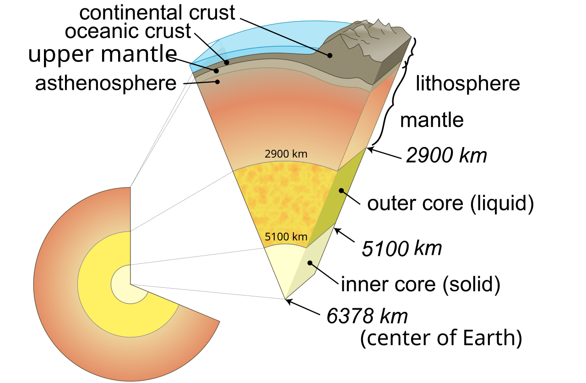
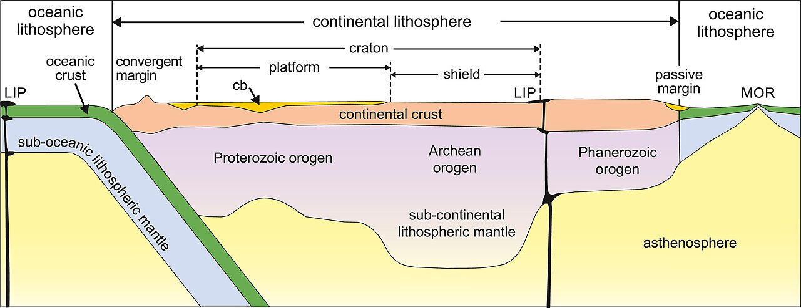
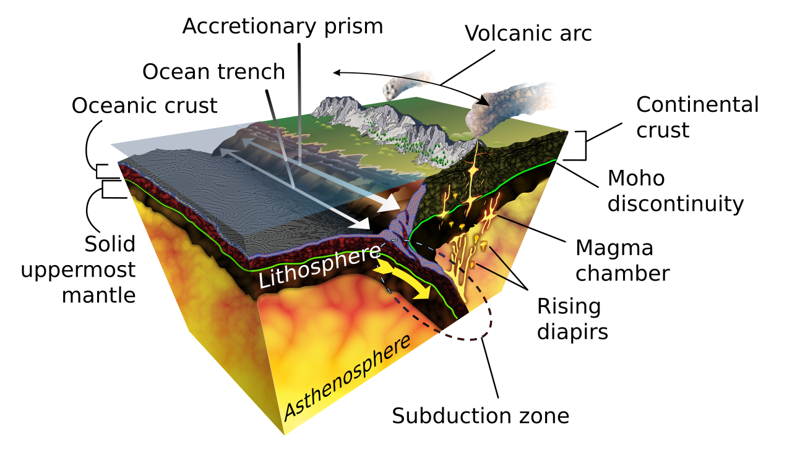

  

# Concepts

- ductility
  - capacity of rock to deform to large strains without macroscopic fracturing
- convection
  - transfer of heat through the physical movement of fluids (liquids or gases) where warmer, less dense material rises and cooler, denser material sinks
- isostatic equilibrium / isostasy
  - state of gravitational equilibrium in which the lithosphere "floats" on the asthenosphere at a certain elevation depending on its density and thickness
- mafic
  - describes silicate minerals, magmas, and ihttps://en.wikipedia.org/wiki/Planetary_differentiationgneous rocks that is high in iron and magnesium and low in silica
- [planetary differentiation](https://en.wikipedia.org/wiki/Planetary_differentiation)

# Lithosphere

- rigid, deforms elastically and through brittle failure
  - it's distinguished from the asthenosphere based on this rigidity, setting the boundary at the transition point between brittle and viscous behavior

- Authors:  Peter A. Cawood, Priyadarshi Chowdhury, Jacob A. Mulder, Chris J. Hawkesworth, Fabio A. Capitanio, Prasanna M. Gunawardana, and Oliver Nebel
- [Wikimedia Commons](https://commons.wikimedia.org/wiki/File:Lithosphere_of_Earth_-_Idealized_Cross-section.jpg)
- [License](https://creativecommons.org/licenses/by/4.0/deed.en)

- oceanic lithosphere
  - mafic crust and ultramafic mantle
  - denser than continental crust, but thinner
    - becomes denser and thicker with time until, through subduction, is recycled back into the mantle
  - continually regenerated at mid-ocean ridges
- subducted lithosphere
  - might be subducted as deep as the mantle-core boundary
  - remains rigid up to 370 miles deep, causing deep earthquakes
- continental lithosphere
  - cannot subduct deeper than 62 miles before resurfacing
    - thus, it is not recycled like oceanic lithosphere

- Author: K.D. Schroeder
- [Subduction.en.svg from Wikimedia Commons](https://commons.wikimedia.org/wiki/File:Subduction-en.svg##)
- [License](https://creativecommons.org/licenses/by-sa/4.0/deed.en)

# Asthenosphere

The name comes from the ancient Greek word "asthenos", "without strength"

- mechanically weak and ductile region of the upper mantle below the lithosphere
- mostly solid
- mechanical weakness is caused by slight melting (less than 0.1% of the rock)
- ductility results from temperature (of entire mantle, closest to melting point) and pressure conditions
  - allows it to act as a convection current, radiating heat outward from the center
  - the asthenosphere then acts as a very slow moving fluid on which the rigid lithosphere "floats", allowing for isostatic equilibrium and the movement of tectonic plates
    - this fluidity is typically attributed to the melt, but this doesn't fully account for it
      - could be due to low solubility of water, resulting in excess water creating a "hydrous silicate melt"
      - or could be due to grain boundary sliding, where grains slide past each other under stress, lubricated by volatiles
- composed of peridotite
- LAB, lithosphere-asthenosphere boundary, is shallower in ocean mantle than continental mantle
- magma generation
  - decompression melting
    - the solidus temperatures, the temperature below which the rock is solid, increases with pressure
    - decompression melting occurs as rock moves outward from inside the Earth, decreasing the pressure exerted on it and thus decreasing its solidus temperature
    - the decrease in solidus outpaces the cooling of its temperature, causing it to melt
  - the movement of the rock outward is caused by convection
  - in general, rocks melt (in other words, their solidus temperature is lowered) due to a decrease in pressure, a change in composition (typically, the addition of water), or an increase in temperature
    - so, the melt in the asthenosphere is a complex combination of these three conditions set in motion by conduction

